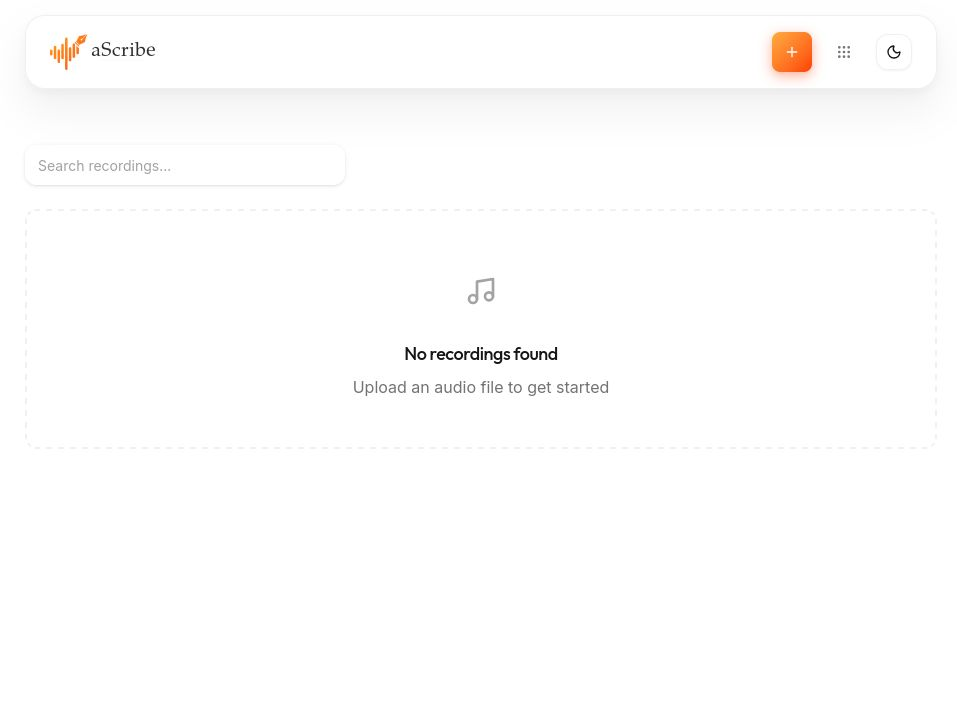
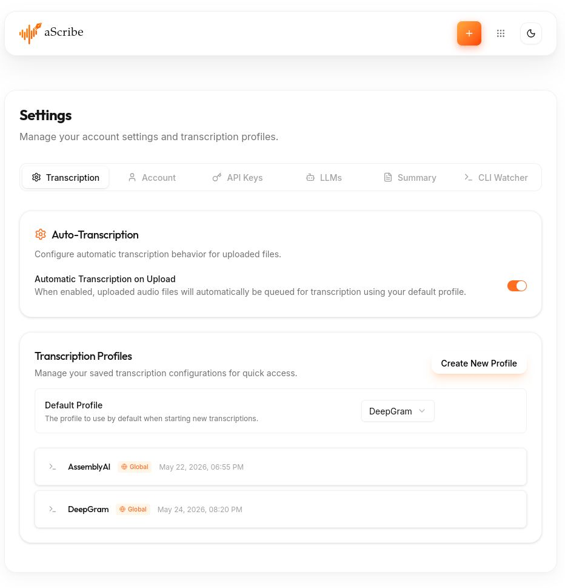
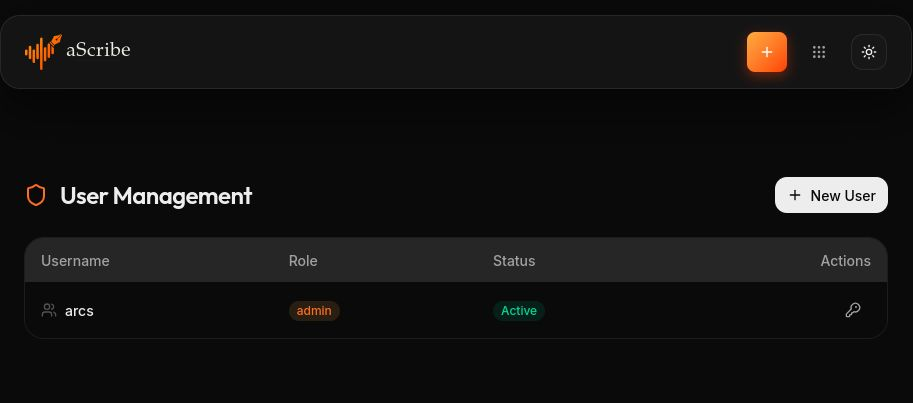

<div align="center">
  
  <picture>
    <source media="(prefers-color-scheme: dark)" srcset="aScribe_logo_clean-cropped.svg">
    
  </picture>
</div>

# aScribe

Audio transcription application with speaker diarization, AI summaries, and multi-provider support.

Fork of [Scriberr](https://github.com/rishikanthc/Scriberr), significantly extended. This version is maintained by [Majorum Network](https://majorum.net/) under the original licence.

## Features

### Transcription
- Local models: WhisperX, Parakeet, Canary, Voxtral
- Cloud providers: AssemblyAI, Deepgram, OpenAI Whisper
- Speaker diarization (PyAnnote, SortFormer)
- Transcription profiles — save and reuse parameter sets; admins can publish global profiles visible to all users

### AI & summaries
- AI summaries with reusable prompt templates; admins can publish global templates
- In-recording chat (OpenAI-compatible)
- Collections for grouping and batch-summarizing recordings

### Multi-user
- Multiple accounts with `admin` and `user` roles
- Admin panel: create users, enable/disable accounts, reset passwords, set full name and email
- All data (jobs, notes, API keys, collections, chat sessions) scoped per user
- Auto-transcription on upload and default profile/template configurable per user
- Session revocation on account disable

### Automation & integration
- CLI watcher for automated folder upload
- Webhook callbacks on job completion
- Per-job API key override for all cloud providers

### Interface
- Inline transcript editing and speaker renaming
- Compact and timeline transcript views with playback speed control
- French / English UI

## Screenshots

<table>
  <tr>
    <td align="center" width="50%">
      
      <br /><sub>Dashboard — light mode</sub>
    </td>
    <td align="center" width="50%">
      
      <br /><sub>Input sources menu</sub>
    </td>
  </tr>
  <tr>
    <td align="center" width="50%">
      
      <br /><sub>Settings — transcription profiles with global publishing</sub>
    </td>
    <td align="center" width="50%">
      
      <br /><sub>User management — dark mode</sub>
    </td>
  </tr>
</table>

## Quick start (Docker)

```bash
docker run -d \
  -p 8080:8080 \
  -v ascribe_data:/app/data \
  -e ASSEMBLYAI_API_KEY=your_key \
  -e OPENAI_API_KEY=your_key \
  ascribe:latest
```

Or with Docker Compose:

```bash
docker compose up -d
```

## Build from source

```bash
make build       # produces ./ascribe binary
make build-cli   # produces CLI binaries in bin/cli/
```

Requires Go 1.24+, Node 20+.

## Key environment variables

| Variable | Purpose |
|---|---|
| `DATABASE_PATH` | SQLite path (default `data/ascribe.db`) |
| `ASSEMBLYAI_API_KEY` | AssemblyAI API key |
| `DEEPGRAM_API_KEY` | Deepgram API key |
| `OPENAI_API_KEY` | OpenAI API key |
| `HF_TOKEN` | Hugging Face token (required for PyAnnote diarization) |
| `APP_ENV` | Set to `production` for secure cookies |
| `WHISPERX_ENV` | UV environment root (default `data/whisperx-env`) |

## License

MIT — see [LICENSE](LICENSE).
